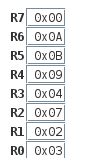
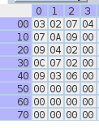

# BlackJack

## Descrição Geral

Este projeto tem como objetivo desenvolver o jogo de BlackJack(popularmente conhecido como 21 no Brasil) em Assembly. 
Para isso foi feito uma algoritmo pseudo-aleatório para gerar as cartas dos baralhos (com os naipes das cartas sendos 
desconsiderados, já que os mesmos são irrelevantes para o jogo). Um deck de BlackJack precisa de um deck 52 cartas, 
como os naipes estão sendo desconsiderados, somente números até 14, são alocados como cartas na memória.

## Algoritmo Pseudo-Aleatório

O algoritmo desta forma, são dados dois números diferentes, neste caso, como queremos números menores que 16,
usamos somente números de 4 bits. Um valor é o da máscara e o outro é o valor a ser mascarado. Uma máscara é 
um valor binário usado em conjunto com uma operação lógica, como ANL (AND lógico), para isolar ou filtrar bits 
específicos de outro valor. Sendo as máscaras valores de 4 bits então, somente os bits menos significativos do 
número mascarado são mantidos. Esse processo é feito após ou seja, rotacionar os bits do número a ser mascarado 
no registrador para a esquerda, passando pelo bit de carry (RLC).

## Como Funciona 

Antes de iniciar o programa o jogador deve no edsim51, inserir números de 0x00 à 0x0D no R1 ao R6, para ter uma 
maior variedades de números inicialmente gerados nas duas cartas que são dadas aos três jogadores. Depois de dadas 
essas cartas os jogadores podem decidir se querem comprar cartas, o botão deve ser pressionado duas vezes, uma para 
iniciar o processo de escolha da carta, e outra para para o processo e permanecer com a carta sorteada. O Jogador 1 
pode pressionar 1 ou 2 no teclado para comprar uma carta(com cada um dos botões sendo uma carta diferente) o Jogador 
2 pode pressionar 3 ou 4, e o Jogador 3 pode pressionar 5 e 6. Se os jogadores quiserem iniciar uma nova partida, 
o jogo/programa deve ser reiniciado.

Os valores das cartas podem ser observados na memória,e estão organizadas da seguinte forma:

Jogador 1:   
Carta 1 = 10H;
Carta 2 = 20H;
Carta 3 = 30H;
Carta 4 = 40H;

Jogador 2:   
Carta 1 = 11H;
Carta 2 = 21H;
Carta 3 = 31H;
Carta 4 = 41H;

Jogador 3:   
Carta 1 = 12H;
Carta 2 = 22H;
Carta 3 = 32H;
Carta 4 = 42H;

# Exemplo

## Setup Incial:

## Resultados da Gerção de Números com todas as cartas compradas:

